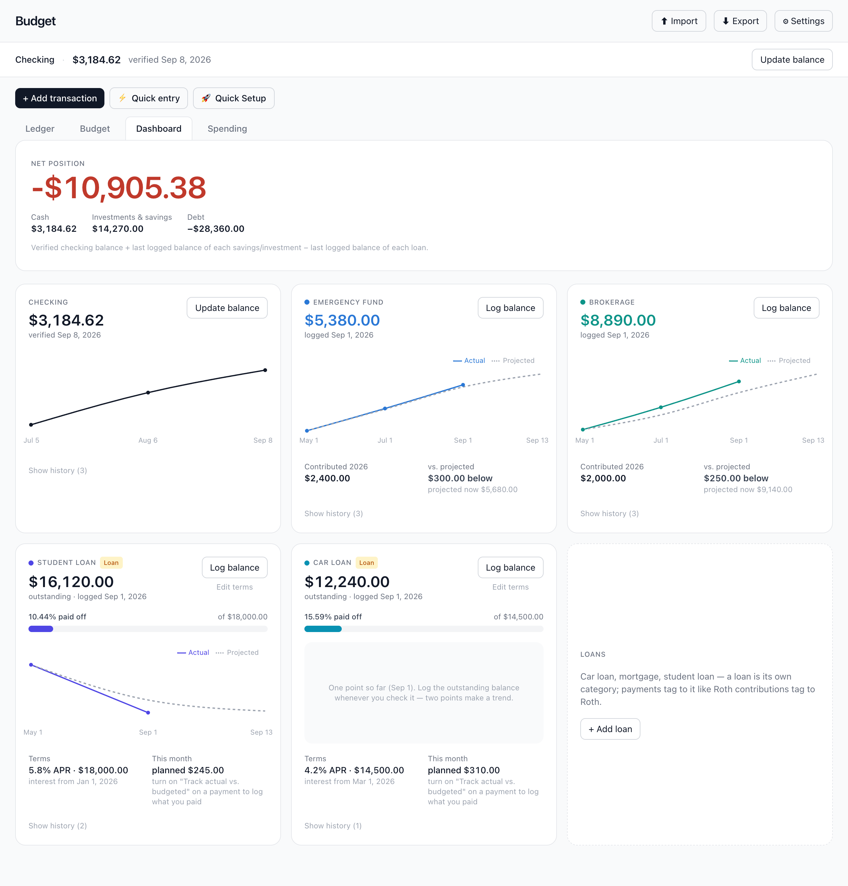
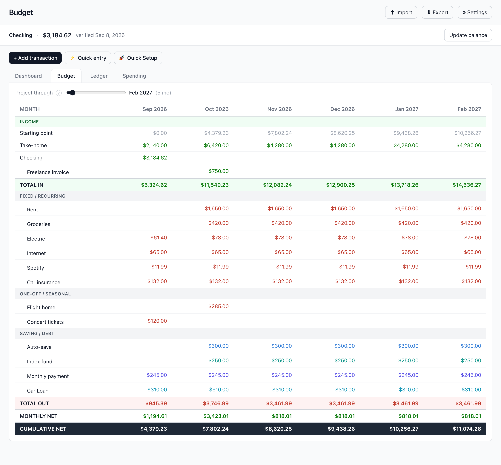
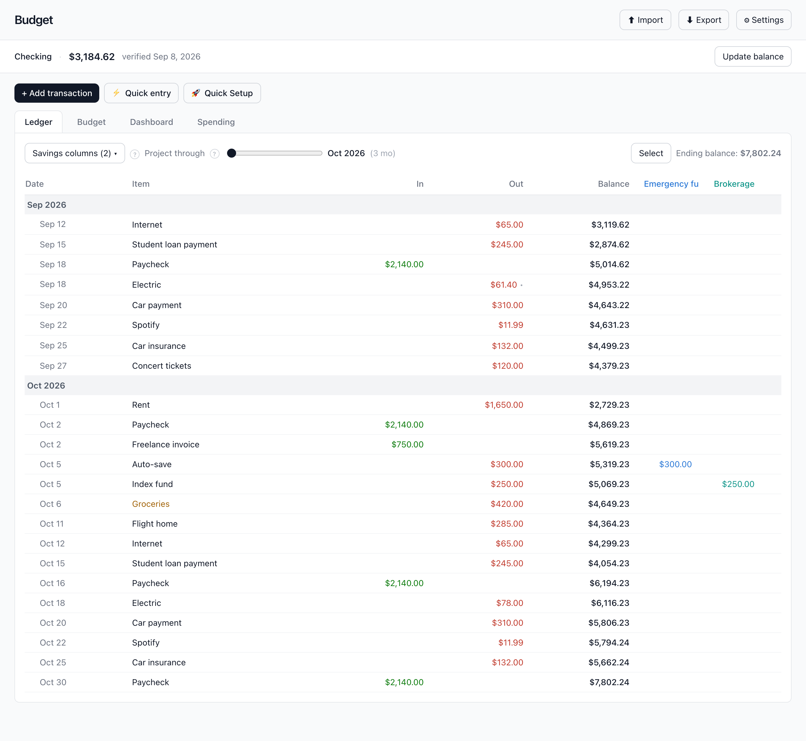
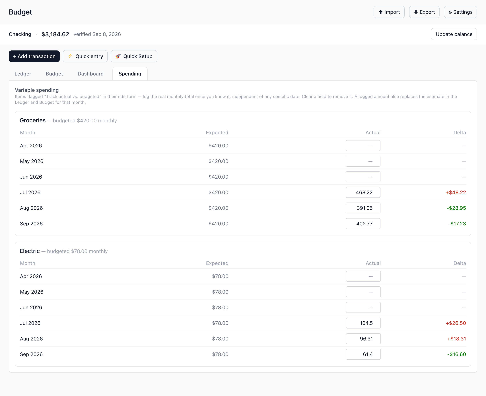

# Budget

A personal cash-flow app that keeps **what you plan** and **what actually
happened** in separate, honest columns.

You describe your money once as rules — a paycheck every two weeks, rent on the
1st, $300 to savings on the 5th — plus the one-off stuff, and the app projects
your checking balance forward day by day. Then you log what's really true: your
verified bank balance, what's actually in each investment account, what you
actually owe on each loan, what groceries actually cost last month. The forecast
tells you where you're headed; the logged numbers tell you where you are. The
app never quietly blends the two.

Built for myself, in the open. **Work in progress** — the web app is live and in
daily use; a companion iOS app sharing the same calculation engine is the goal.

---

## The four tabs

### Dashboard — the reality layer



Net position at the top: verified checking, plus the last balance you logged for
each savings/investment account, minus the last balance you logged for each loan
(with an explicit count of anything not logged yet — no silent zeros).

Then a card per account. Savings and investment cards chart what you've logged
against a dotted projection of your scheduled contributions, and show what you
contributed this year — a market dip isn't a failure, so the comparison is
worded neutrally, never as good/bad. Loan cards show the outstanding balance you
logged, how much of the original principal you've paid off, the terms, and this
month's planned payment. They deliberately never show "expected remaining vs.
actual remaining" — that framing only scolds.

Accounts and loans are created here too — "+ Add account" and "+ Add loan"
open their own short setup form. A savings account or a loan is its own
category with its own color (and, for a loan, APR and interest start date);
money moving in or out is an ordinary transaction tagged to it, so setting one
up never invents a transaction.

### Budget — month by month



Every month as a column: income (with take-home computed from actual paycheck
dates, so a three-paycheck month shows three), fixed and recurring costs,
one-offs, saving and debt payments clustered by category, and the cumulative
net carried forward. Rows are reorderable, the horizon is a slider.

### Ledger — every transaction, in order



The projection expanded into individual dated transactions with a running
balance, grouped by month. Optional cumulative columns per savings category,
per-item colors, mark-a-bill-paid for the current month, multi-select delete,
and a horizon slider of its own.

Savings and loan rows also name their category next to the item, since
"Monthly payment" on its own doesn't say which loan it pays down.

Anything dated before your last verified balance is dropped rather than
double-counted — that money is already *in* the number.

### Spending — actual vs. budgeted



Flag a variable bill (groceries, electric) as tracked and log the real total for
the month whenever you find out — no need to match it to a date. The logged
amount replaces the estimate everywhere: Ledger, Budget, and the loan math all
see the real number.

---

## Also in here

- **Google sign-in or a magic link**; your data is per-account and private.
- **Per-device theme** — light on the laptop, dark on the phone, from one account.
- **Quick Setup** wizard for a new account, and quick-entry for adding a batch
  of items without closing a modal each time.
- **A built-in tutorial** covering every feature, kept in sync with the code by
  the same rule as this README.
- **Import** a budget-grid CSV, a per-transaction CSV (it detects recurrence),
  or restore a full JSON backup — which downloads a safety copy of your current
  data first.
- **Export** the Ledger or Budget as CSV, or the whole account as JSON.
- Fully editable, fully deletable logged values. Nothing is append-only.

---

## Tech stack

React 18 + Vite · Tailwind CSS v3 · Recharts · Supabase (Postgres + Auth) ·
deployed on Vercel · GitHub Actions for CI. No state library, no component
library, no backend of my own.

## Architecture

```
src/
  engine/       pure calculation — no React, no network, no DOM
  components/   React views; they render and call mutators, nothing else
  storage.js    the ONLY place that talks to the backend
  App.jsx       owns the single state object; loads it once, autosaves changes
tests/          the engine test suite (plain Node, no framework)
supabase/       schema.sql — one table, RLS policies
```

**Everything with a number in it lives in `src/engine`** as a pure function of
the state. That's the whole design decision the rest follows from:

- It's testable without a browser. `npm test` runs ~250 assertions over
  amortization, budget math, every data migration, and CSV round-trips in about
  a second, with no test framework at all.
- The Ledger and the Budget can't disagree, because both are derived from one
  generated event list rather than computed separately.
- An iOS client can reuse the engine verbatim instead of reimplementing (and
  subtly mis-implementing) the money math.
- Swapping the backend means rewriting one file, `storage.js`.

All user data is a single JSON document per user, stored as `jsonb`. Row-level
security (`auth.uid() = user_id`) is the access boundary; the anon key in the
browser bundle is public by design. Every shape change goes through one
`normalize()` function that runs on every load and is idempotent and
deterministic, with before/after assertions in the test suite — because losing
real financial history once is enough.

## Run it locally

Requires Node 20+.

```bash
git clone https://github.com/ethanrkey/new-budget-app
cd new-budget-app
npm install
```

Create a Supabase project, run `supabase/schema.sql` in its SQL editor, and
enable the Google provider (or just use magic links). Then:

```bash
cp .env.example .env.local     # fill in both values from Supabase → API
npm run dev
```

```
VITE_SUPABASE_URL=https://<project>.supabase.co
VITE_SUPABASE_ANON_KEY=<the publishable/anon key>
```

Other scripts: `npm test` (engine suite), `npm run lint`, `npm run build`.
CI runs all three on every push.

## Status and what's next

In daily use and actively built on. Near-term: reorderable tabs, goal-based
savings targets. Later: multiple accounts and payment methods,
credit cards, bank linking, and the iOS client.

Design decisions, the full data model, and the roadmap live in
[PROJECT_SPEC.md](PROJECT_SPEC.md), which is kept in sync with the code by rule.

> Screenshots are generated from fixture data. None of the numbers are mine.
