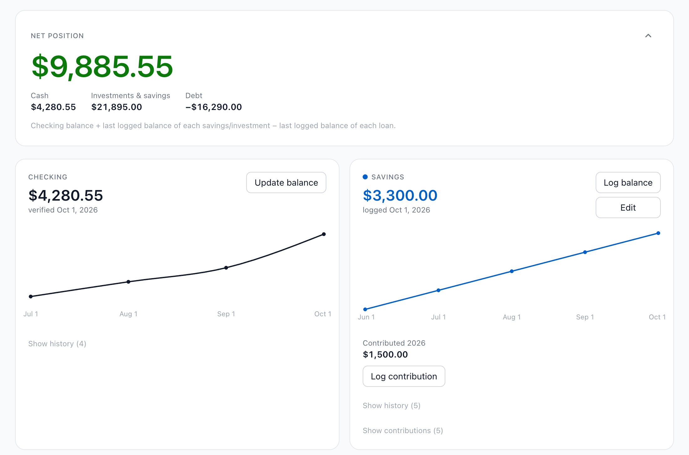
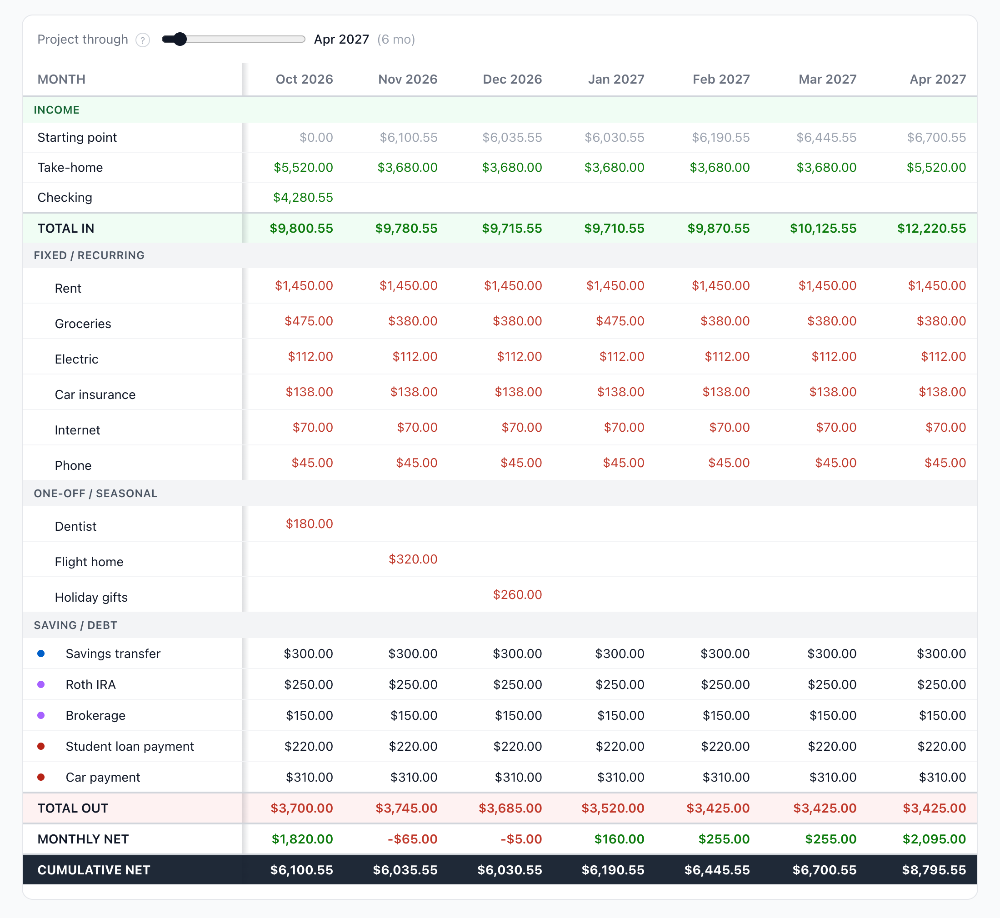
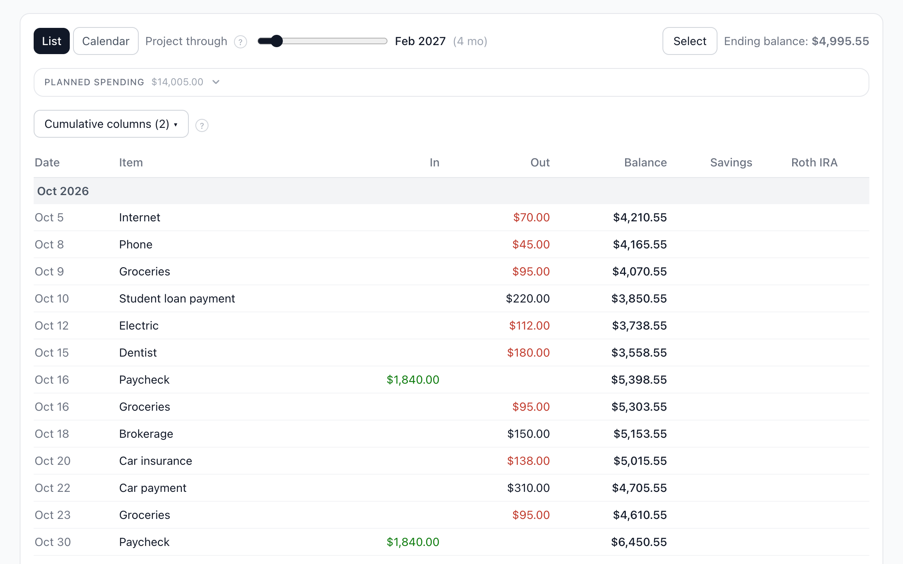
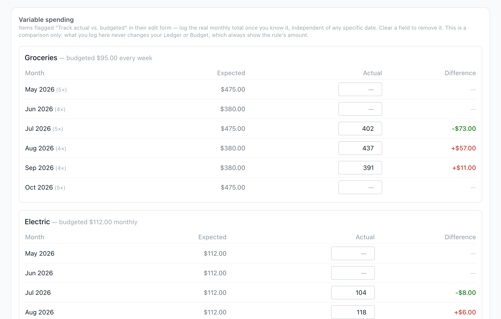

# Key Budget

A personal cash-flow app that keeps **what you plan** and **what actually
happened** in separate, honest columns.

You describe your money once as rules — a paycheck every two weeks, rent on the
1st, $300 to savings on the 5th — plus the one-off stuff, and the app projects
your checking balance forward day by day. Then you log what's really true: your
verified bank balance, what's actually in each investment account, what you
actually owe on each loan, what groceries actually cost last month. The forecast
tells you where you're headed; the logged numbers tell you where you are. The
app never quietly blends the two.

Built for myself, in the open. **Work in progress** — the web app is live and in
daily use, and an Expo/React Native iOS client in `mobile/` shares the same
calculation engine verbatim — it reads everything and can log a balance, with
the rest of the write path still to come.

---

## The four tabs

### Dashboard — the reality layer



Net position at the top: verified checking, plus the last balance you logged for
each savings/investment account, minus the last balance you logged for each loan
(with an explicit count of anything not logged yet — no silent zeros).

The hero collapses if you'd rather not be met by a big number, and stays that
way on that device. Debt collapses the same way, and does it by default: one
card showing what you owe in total and a scrolling list of each loan, which
expands into a card per loan when you want the detail.

Then a card per account. Savings and investment cards chart the balances you've
logged — just that one line — plus what you've actually contributed, logged one
contribution at a time. Not summed from the ledger: the ledger is a plan, and a
plan labeled "contributed" is a lie you tell yourself. An account you never log
(a 401k taken out before the paycheck) says so rather than claiming $0.00. There's no projected line on them on purpose: for a savings
account it's arithmetic you can do in your head, and for anything market-
exposed it can't tell a market dip apart from a transaction you never recorded.
Loan cards show the outstanding balance you
logged, how much of the original principal you've paid off, the terms, and this
month's planned payment, and they DO keep a projected line — amortization is
real math about a known quantity, not a guess about a market. They deliberately
never show "expected remaining vs. actual remaining" — that framing only
scolds. A loan you owe more on than you
borrowed (an unsubsidized one, before payments start) says so honestly —
"$2,302.73 owed · $2,000.00 borrowed · $302.73 accrued interest" — instead of
a percentage against a number the balance has already passed.

Accounts and loans are created here too — "+ Add account" and "+ Add loan"
open their own short setup form. A savings account or a loan is its own
category (and, for a loan, APR and interest start date); money moving in or
out is an ordinary transaction tagged to it, so setting one up never invents a
transaction. You don't pick colors anywhere: color encodes what the money is
DOING — income, a bill, a one-off, savings, an investment, debt — so the same
kind of money is the same color in every view, and two savings accounts look
related instead of arbitrary.

### Budget — month by month



Every month as a column: income (with take-home computed from actual paycheck
dates, so a three-paycheck month shows three), fixed and recurring costs,
one-offs, saving and debt payments clustered by category, and the cumulative
net carried forward. Rows are reorderable, the horizon is a slider.

### Ledger — every transaction, in order



The projection expanded into individual dated transactions with a running
balance, grouped by month — or the same data as a **month calendar**, with
colored dots and each day's net, and a click for the day's transactions. (The
running balance stays in the list; a month grid has nowhere honest to put it.)
Either way there's a collapsible **Planned spending** breakdown
above it — where the money in this window is going, by category, as a pie or a
horizontal bar. It's the forecast, and it says so: no logged number touches
it. Bills and one-offs are always shown as their own transactions rather than
as one slice — "Fixed bills" is where anything uncategorized lands, so grouping
by it tells you nothing — while the categories you made stay whole. Past
eight slices the tail folds into "Other", which opens on click — in the legend
for the pie (whose wedge never changes shape), in place for the bar — and the
summary row is replaced by its parts rather than sitting above them. Optional cumulative columns per savings category,
multi-select delete, a different amount for one date
(Electric is $112 but $180 in July) without breaking the rule,
and a horizon slider of its own, capped at a year — the Ledger is a near-term
guide, and the Budget is the tab for a long projection.

Anything dated before your last verified balance is dropped rather than
double-counted — that money is already *in* the number.

### Spending — actual vs. budgeted



Flag a variable bill (groceries, electric) as tracked and log the real total for
the month whenever you find out — no need to match it to a date. It's a
comparison and nothing more: what you log here never changes the Ledger or the
Budget, which always show what your rule says. Forecast and reality stay in
separate columns, here as everywhere else.

---

## Also in here

- **Google sign-in or a magic link**; your data is per-account and private.
- **Per-device theme** — light on the laptop, dark on the phone, from one account.
- **Drag the tabs** into your own order (desktop); the app opens on the first one.
- **A setup wizard** that gets you from nothing to a working forecast —
  paycheck, rent, bills, groceries, your checking balance, and one screen
  for the savings, investments and debt you want on the Dashboard. Then a
  short guided tour of the four tabs. Quick entry is the other half of it:
  add a batch of items without the modal closing between each one.
- **A built-in About page** covering every feature, kept in sync with the code by
  the same rule as this README.
- **Import** a budget-grid CSV, a per-transaction CSV (it detects recurrence),
  or restore a full JSON backup — which downloads a safety copy of your current
  data first. A CSV import brings in items only: it never moves your verified
  balance, which has one entry point and needs a date you supply.
- **Delete your account** from Settings: a 7-day grace period you can cancel,
  then everything goes, including the sign-in itself.
- **Export** the Ledger or Budget as CSV, or the whole account as JSON.
- Fully editable, fully deletable logged values. Nothing is append-only.
- **Safe on more than one device** — a phone holding an out-of-date copy can't
  overwrite newer data, and says so instead of failing silently. Anything it
  had to discard is kept as a downloadable copy.

---

## Tech stack

React 18 + Vite · TypeScript (the whole engine; the UI stays JSX) · Tailwind CSS v3 ·
Recharts · Supabase (Postgres + Auth) · deployed on Vercel · GitHub Actions for
CI. No state library, no component library, no backend of my own.

## Architecture

```
src/
  engine/       pure calculation in TypeScript — no React, no network, no DOM
  components/   React views; they render and call mutators, nothing else
  storage.js    the ONLY place that talks to the backend
  App.jsx       owns the single state object; loads it once, autosaves changes
mobile/         the Expo client; imports src/engine directly, never a copy
tests/          the engine test suite (plain Node, no framework)
scripts/        migration, verification, the palette gate, the screenshots
supabase/       entities.sql — one table, RLS policies (audited live 2026-10-02; see PROJECT_SPEC §5)
```

**Everything with a number in it lives in `src/engine`** as a pure function of
the state. That's the whole design decision the rest follows from:

- It's testable without a browser. `npm test` runs ~620 assertions over
  amortization, budget math, every data migration, and CSV round-trips in about
  a second, with no test framework at all.
- The Ledger and the Budget can't disagree, because both are derived from one
  generated event list rather than computed separately.
- The iOS client reuses the engine verbatim instead of reimplementing (and
  subtly mis-implementing) the money math. That is why the engine is the part
  that got typed: its exports are a contract between two codebases, not an
  internal detail. `mobile/metro.config.js` is three lines of resolver config
  and no build step — which is what the purity rule buys.
- Swapping the backend means rewriting one file, `storage.js`.

User data is **one row per entity** in `budget_entities`, keyed
`(user_id, kind, entity_id)` — a rule, a one-off, a category, one logged
balance. Each row carries its own version counter, so two devices editing
different things never conflict, and a delete is a tombstone rather than a
missing row (an absent row cannot outrank a stale device's copy of it). It was
a single `jsonb` document per user until 2026-10-03; that table is now frozen.
Row-level security (`auth.uid() = user_id`) is the access boundary; the anon
key in the browser bundle is public by design. Every shape change goes through
one `normalize()` function that runs on every load and is idempotent and
deterministic, with before/after assertions in the test suite — because losing
real financial history once is enough.

## Run it locally

Requires Node 24+.

```bash
git clone https://github.com/ethanrkey/new-budget-app
cd new-budget-app
npm install
```

Create a Supabase project, run `supabase/entities.sql` in its SQL editor
(`schema.sql` is the retired single-document table, kept only so the migration
history reads), and enable the Google provider (or just use magic links).
Then:

```bash
cp .env.example .env.local     # fill in both values from Supabase → API
npm run dev
```

```
VITE_SUPABASE_URL=https://<project>.supabase.co
VITE_SUPABASE_ANON_KEY=<the publishable/anon key>
```

Other scripts: `npm test` (engine suite + migrations + the palette gate),
`npm run lint`, `npm run typecheck`, `npm run build`. CI runs all of them on
every push. `npm run screenshots` regenerates the four images above from
fixture data — they are generated, not taken, so they cannot quietly drift
from the UI.

## Status and what's next

In daily use and actively built on. Near-term: finishing the iOS client's
write path and shipping it, then goal-based savings targets. Later: multiple
accounts and payment methods, credit cards, and bank linking.

Design decisions, the full data model, and the roadmap live in
[PROJECT_SPEC.md](PROJECT_SPEC.md), which is kept in sync with the code by rule.

> Screenshots are generated from fixture data (`npm run screenshots`). None of
> the numbers are mine.
